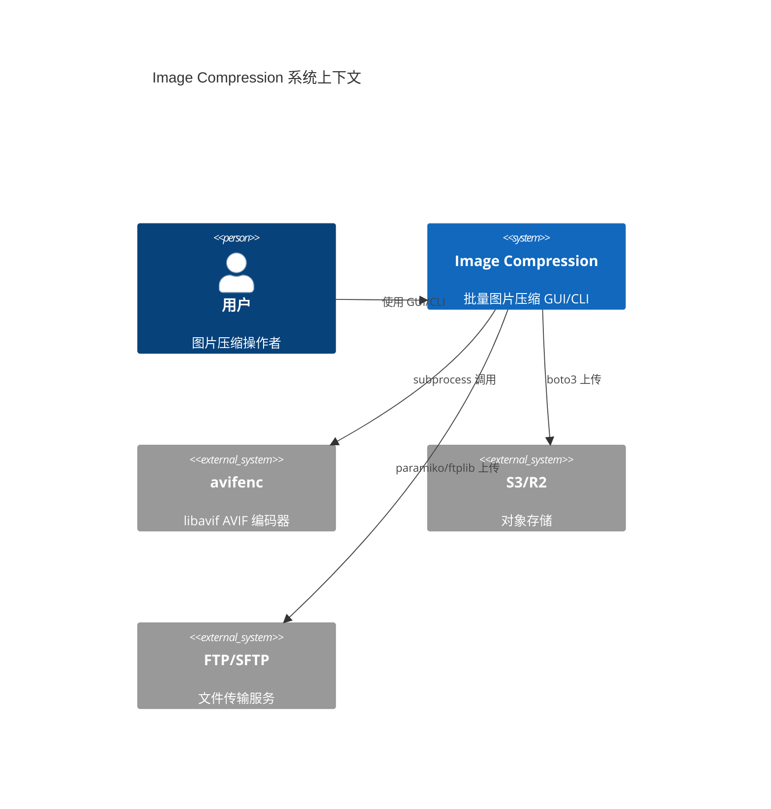
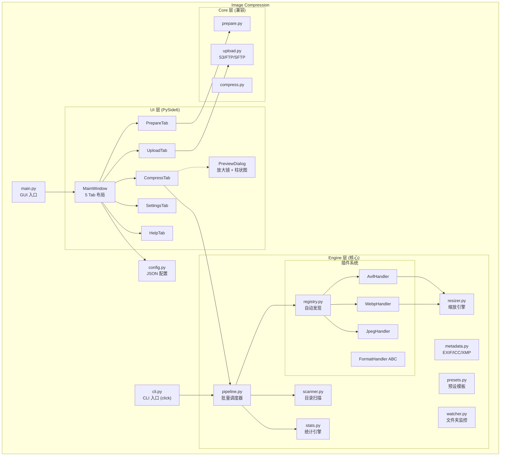
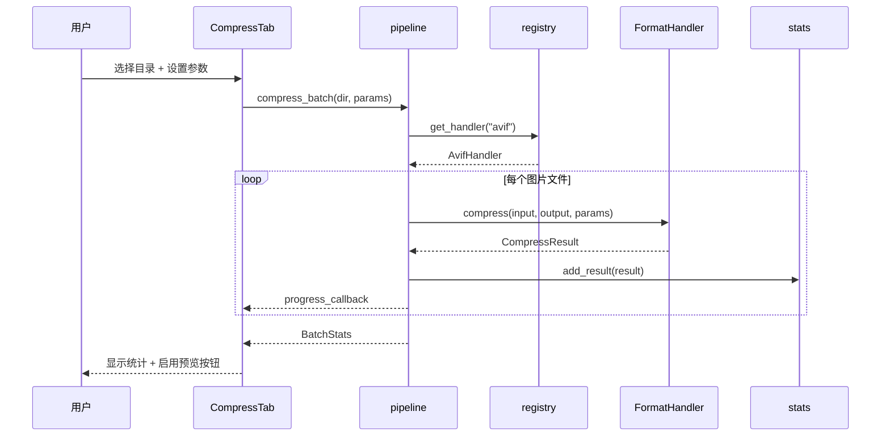

# 架构文档

> Image Compression v2.0 系统架构描述

## 概览

Image Compression 是一个批量图片压缩平台，采用 **分层插件架构**，支持 GUI / CLI / API 三种使用模式。核心设计目标：

1. **核心逻辑与 UI 解耦** — engine 层独立于 ui 层
2. **格式可扩展** — FormatHandler ABC + 注册表模式
3. **并行安全** — 线程池 + AVIF 原生多线程不冲突

## 系统上下文



## 容器架构



## 组件详情

### Engine 层

| 模块 | 职责 | 关键类/函数 |
|---|---|---|
| `formats/base.py` | 定义抽象接口 | `FormatHandler` ABC, `CompressParams`, `CompressResult`, `ImageInfo` |
| `formats/registry.py` | 插件管理 | `register_handler()`, `get_handler()`, `_auto_discover()` |
| `formats/avif.py` | AVIF 编码 | `AvifHandler` — 通过 subprocess 调用 avifenc |
| `formats/webp.py` | WebP 编码 | `WebpHandler` — 使用 Pillow |
| `formats/jpeg.py` | JPEG 编码 | `JpegHandler` — 使用 Pillow |
| `pipeline.py` | 批量调度 | `compress_batch()` — 并行/串行 + 重试 + 冲突策略 |
| `scanner.py` | 目录扫描 | `scan_directory()` — 递归/HEIC/Y4M 支持 |
| `stats.py` | 统计引擎 | `BatchStats` — 压缩率/速度/每文件详情 |
| `resizer.py` | 图片缩放 | `resize_image()` — 宽度/高度/比例 |
| `metadata.py` | 元数据控制 | EXIF/ICC/XMP 保留/清除 |
| `presets.py` | 预设模板 | 5 种: web/mobile/lossless/max_compress/hdr |
| `watcher.py` | 文件夹监控 | `FolderWatcher` — watchdog + 防抖 |

### UI 层

| 模块 | 职责 |
|---|---|
| `main_window.py` | 5 Tab 主窗口 + 一键执行 + 拖放 |
| `compress_tab.py` | AVIF 全参数面板 + 预览按钮 |
| `prepare_tab.py` | 目录扫描 + 重命名 + EXIF 清除 |
| `upload_tab.py` | S3/FTP/SFTP + 自定义域名 |
| `settings_tab.py` | 语言/主题切换 + avifenc 路径 |
| `help_tab.py` | CLI 使用说明 (HTML 富文本) |
| `preview_dialog.py` | 放大镜 ZoomLabel + 柱状图 SizeBarWidget |
| `theme.py` | 浅色 + 深色 QSS 样式表 |
| `i18n.py` | 150+ 条中英翻译 |

## 关键设计决策

### 1. 插件注册表模式

```python
# registry.py — 模块加载时自动注册
def _auto_discover():
    from engine.formats import avif, webp, jpeg

# 各格式模块底部自注册
register_handler(AvifHandler())
```

**理由**：新增格式只需实现 `FormatHandler` 并在 `_auto_discover()` 中导入，核心管线零修改。

### 2. AVIF 使用 subprocess

**理由**：avifenc 原生 C 实现性能远优于 Python 绑定，且支持 libavif 1.4 全部新特性（Gain Map / 渐进式）。

### 3. 并行策略

- **AVIF**：串行调度，因 avifenc 自带 `--jobs` 多线程
- **WebP/JPEG**：ThreadPoolExecutor 并行

### 4. 鸭子类型适配

`prepare_tab` 通过鸭子类型兼容 `engine.scanner.ScanResult`，避免循环依赖。

## 数据流



## 配置管理

```python
@dataclass
class Config:
    last_input_dir: str       # 上次输入目录
    last_output_dir: str      # 上次输出目录
    prepare: PrepareConfig    # 准备选项
    compress: CompressConfig  # 压缩选项
    upload: UploadConfig      # 上传选项 (S3/FTP/SFTP)
    avifenc_path: str         # avifenc 路径
    language: str             # zh / en
    theme: str                # light / dark
```

持久化路径：`~/.imagecompression/config.json`
