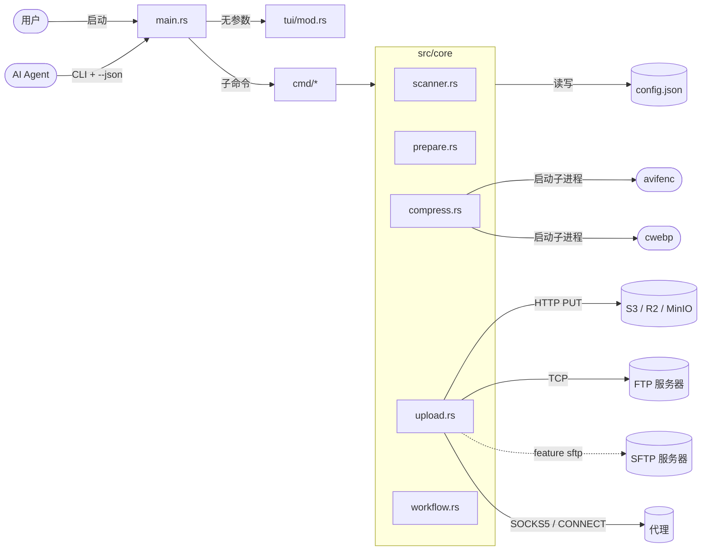
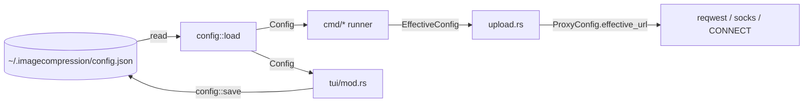
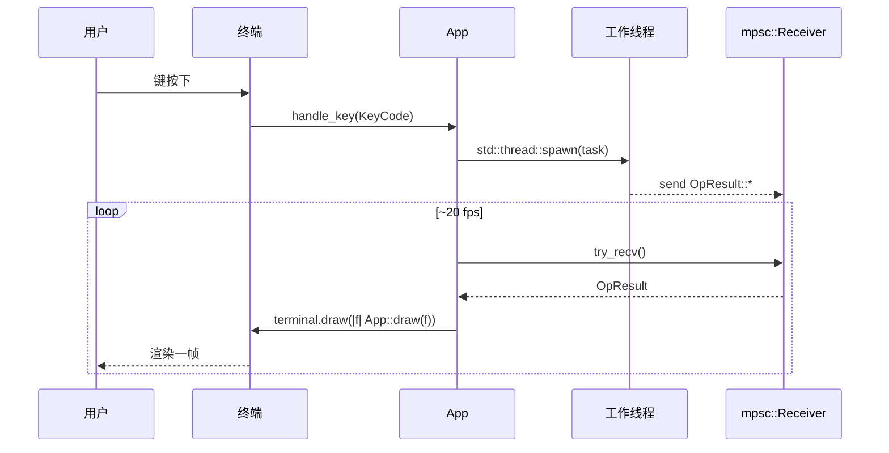

# 架构

本文档说明 ImageCompression 的组织方式、各组件如何交互,以及主要的数据
流路径。

## 目标与约束

- **纯 Rust**(无 Go、无 Wails、无 React 运行时)——单二进制,便于分发。
- **一个二进制,两种模式**:无参数 → 交互式 TUI;带参数 → 非交互式 CLI。
- **面向 AI Agent 友好**:每个 CLI 子命令都支持 `--json`,输出确定性的、
  按行分隔的 JSON 事件流。
- **向后兼容**:旧版 Go 构建写入的 `~/.imagecompression/config.json`
  仍能干净地加载。
- **依赖精简**:只用所需;外部编码器(`avifenc`、`cwebp`)作为子进程调用,
  而非 vendored 进项目。

## 总体结构



## 模块地图

```
src/
├── main.rs           # argv 分发:TUI / 子命令 / help / version
├── config.rs         # Config 结构、load()、save()、normalize_avifenc_path()
│                     # ProxyConfig.normalize() + effective_url()
├── theme.rs          # icon_for_ext() — 每个文件类型的 emoji
├── cmd/
│   ├── mod.rs        # 命令注册表 + 帮助文本渲染 + ANSI 颜色码
│   ├── scan.rs       # scan 子命令
│   ├── prepare.rs    # prepare 子命令
│   ├── compress.rs   # compress 子命令
│   ├── upload.rs     # upload 子命令
│   └── all.rs        # all 子命令(一次性工作流)
├── core/
│   ├── mod.rs        # 重新导出子模块 + 测试模块挂载
│   ├── scanner.rs    # scan_directory()、ScanResult、自然排序
│   ├── prepare.rs    # plan_operations()、execute_operations()
│   ├── compress.rs   # compress_directory()、resize_image()、命令构造器
│   ├── upload.rs     # Uploader trait + S3/FTP/SFTP 实现 + SigV4 + 代理 dialer
│   └── workflow.rs   # run_prepare_compress_upload() —— 组合流水线
└── tui/
    └── mod.rs        # App、run()、run_loop()、draw()、handle_key()
```

### `src/main.rs` —— 入口

`entry()`(`src/main.rs:18`)解析 `argv`:

- **无参数** → `tui::run()`(交互式)。
- **`--help` / `-h` / `help`** → 顶层帮助。
- **`--version` / `-V` / `version`** → 打印 `env!("CARGO_PKG_VERSION")`。
- **`<command> --help`** → 通过 `cmd::print_command_help` 输出该命令的帮助。
- **其他** → 按第一个参数分发:`scan | prepare | compress | upload | all`。

错误通过 `anyhow::Result` 与 `{e:#}` 格式化,以便显示错误链。

### `src/config.rs` —— 持久化配置

包含 `Config` 结构(`src/config.rs:141`)及其子结构
(`PrepareConfig`、`CompressConfig`、`UploadConfig` 等)。关键行为:

- `default_config()`(`src/config.rs:165`)返回内置默认值,因此首次运行无需
  任何文件即可工作。
- `load()`(`src/config.rs:230`)从指定路径读取 JSON,缺省回退到
  `~/.imagecompression/config.json`;若文件缺失或解析失败,则返回默认值
  而不是错误。
- `save()`(`src/config.rs:247`)先归一化再序列化回文件。
- `normalize_avifenc_path()`(`src/config.rs:262`)会把 `avifenc.exe` 这样的
  单独可执行文件名,或以 `avifenc.exe` 结尾的完整路径,折叠为父目录,
  与旧 Go 构建解析工具位置的方式保持一致。
- `ProxyConfig::normalize()`(`src/config.rs:284`)桥接旧版 `url` 字符串与
  新的结构化字段 `{type, host, port, username, password}`。保存时始终使用
  结构化表示;旧版 `url` 字段仅用于读取兼容。

### `src/cmd/*` —— CLI 子命令

每个子命令文件实现单一的 `pub fn run(args: &[String]) -> Result<()>`,
内部自行手写解析 `argv`。它们共享以下约定:

- 除 `version` 与 `help` 之外,所有命令都要求 `--input <dir>`。
- `--json` 把子命令切换为结构化事件输出。
- 输出到 stdout,错误通过 `anyhow` 链打到 stderr。
- 当任何文件失败时返回退出码 `1`(`src/cmd/compress.rs:196`、
  `src/cmd/upload.rs:94`,以及 `src/cmd/all.rs:120` 压缩失败、
  `:150` 上传失败)。

颜色码 `G`(green)、`D`(dim)、`B`(bold)、`R`(reset)
(`src/cmd/mod.rs:9`)在所有子命令中复用,以保持非 JSON 输出的可读性。

### `src/core/*` —— 领域逻辑

`core` 是库风格的:每个子模块暴露接近纯函数,CLI 与 TUI 都可以调用。
没有隐藏的全局单例 —— 进度回调与 runner 都显式传入,便于测试替换。

#### `core/scanner.rs`

- `scan_directory(root, recursive)`(`src/core/scanner.rs:40`)遍历目录树
  (递归用 `walkdir`,非递归用 `fs::read_dir`),按扩展名把文件分类到
  `images` / `videos` / `others`,累计 `total_size`,并统计扫描过的
  子目录数。
- `natural_sort` / `natural_less`(`src/core/scanner.rs:105`)实现 Go 风格的
  自然排序,保证 `image2.jpg` 排在 `image10.jpg` 之后(而非之前)。
- `is_image_like(path)`(`src/core/scanner.rs:141`)是"这个路径是图片吗?"
  的唯一判定 —— TUI 的条目列表过滤复用之。

#### `core/prepare.rs`

- `plan_operations(scan, output_dir, opts)`(`src/core/prepare.rs:46`)按
  父目录把扫描到的文件分组,计算相对于扫描根的相对路径,并生成
  `(source, destination, kind)` 操作列表,应用命名规则
  (`{:04}.jpg`、`video{:03}.xxx`)。
- `execute_operations(ops, overwrite, progress)`(`src/core/prepare.rs:150`)
  遍历计划,除非 `overwrite=true` 否则拒绝覆盖已有文件,按需创建父目录,
  并执行复制。`progress` 回调在每个文件处被调用,传入
  `(current, total, message)`。

#### `core/compress.rs`

最大的领域模块。关键接口:

- `Params`(`src/core/compress.rs:19`)—— quality、speed、lossless、
  resize mode、resize value、aspect-ratio、元数据标志,以及
  `extra: HashMap<String, serde_json::Value>`(用于 `min_quality`、
  `max_quality`、`threads`、`yuv`、`depth`、`alpha_min` 等临时选项)。
- `BatchOptions`(`src/core/compress.rs:39`)—— 批处理的参数集合
  (input dir、output dir、format、recursive、overwrite、conflict strategy、
  encoder 路径、worker 数、params)。
- `BatchResult` / `CompressResult`(`src/core/compress.rs:81`,`:63`)——
  批处理返回的结果。
- `ProgressEvent`(`src/core/compress.rs:103`)—— 统一的进度事件;CLI 的
  `--json` 与 TUI 使用同一形状。
- `compress_directory(ctx, opts, runner, progress)`
  (`src/core/compress.rs:532`)—— 调度入口:
  1. 归一化选项,
  2. 收集图片文件(递归或非递归),
  3. 发出 `start` 事件,
  4. 串行迭代(AVIF 在 `src/core/compress.rs:559` 处强制单线程),
     对每个文件调用 `compress_one`,
  5. 发出单文件进度事件,
  6. 发出最终的 `done` 事件及总计。
- `compress_one`(`src/core/compress.rs:471`)—— 按格式三分支:
  - **avif** —— 通过 `build_avif_command`(`src/core/compress.rs:371`)
    调用 `avifenc`。
  - **webp** —— 通过 `build_webp_command`(`src/core/compress.rs:437`)
    调用 `cwebp`。
  - **jpeg** —— 纯 Rust `image::codecs::jpeg::JpegEncoder`。
- 缩放模式在 `resize_image`(`src/core/compress.rs:242`)中实现,
  详见 [API.md](./API.md)。
- 在 Windows 上,`configure_hidden`(`src/core/compress.rs:340`)给子进程
  设置 `CREATE_NO_WINDOW`,避免编码器调用时弹出控制台窗口。
- `Runner` 回调(`src/core/compress.rs:128`)是测试的接缝 —— 可用它替换
  真实子进程调用为确定性闭包。

#### `core/upload.rs`

- `Uploader` trait(`src/core/upload.rs:54`)—— `connect`、`upload_file`、
  `disconnect`。三个实现:
  - `S3Uploader`(`src/core/upload.rs:267`)—— 完整的 AWS SigV4 PUT,带路径
    编码、`us-east-1` region 回退,以及 AWS virtual-host 或自定义 endpoint
    path-style URL 两种风格。
  - `FtpUploader`(`src/core/upload.rs:575`)—— `suppaftp`,通过
    `connect_with_stream` 与自定义 `passive_stream_builder` 提供
    passive 模式的代理支持,让每个数据通道连接都走代理 dialer。
  - `SftpUploader`(`src/core/upload.rs:651`)—— 仅在 `sftp` feature 启用时
    编译;基于 `ssh2` 跑在 `TcpStream` 之上(也支持走代理 dialer 隧道),
    支持密码与公钥认证。
- `UnsupportedUploader`(`src/core/upload.rs:765`)—— 当 SFTP 被请求但二进制
  未启用对应 feature 时返回的占位符,这样错误信息是可操作的,而不是 panic。
- `effective_config(cfg, source_dir)`(`src/core/upload.rs:99`)—— 若未设置
  `custom_path`,则用源目录的 basename 派生远程前缀/远程目录;否则把
  `custom_path` 拼到协议特定的基础位置。
- `upload_directory(...)`(`src/core/upload.rs:164`)—— 调度入口:
  收集文件 → `connect` → 逐个上传(发出进度事件)→ `disconnect`。
  单文件错误被累积,不会中断整个批处理。
- `sign_s3_put(...)`(`src/core/upload.rs:484`)—— 完整的 AWS SigV4 签名器:
  canonical request → string-to-sign → 派生的 signing key → 签名,带四个
  必需的 header(`content-type`、`host`、`x-amz-content-sha256`、
  `x-amz-date`)。
- `new_proxy_dialer(proxy_url)`(`src/core/upload.rs:781`)—— 闭包工厂,
  返回一个函数用于通过 SOCK5 代理(用 `socks` crate,支持用户名/密码)
  或 HTTP-CONNECT 代理 dial `host:port`。

#### `core/workflow.rs`

`run_prepare_compress_upload(opts)`(`src/core/workflow.rs:18`)在你希望
三个流水线阶段共享状态时把它们串联起来。CLI 的 `all` 命令内联重新实现了
同一序列(`src/cmd/all.rs:67`),以便在阶段之间流式发出 `--json` 事件。

### `src/tui/mod.rs` —— 交互式界面

`pikpaktui` 风格的三列 Miller 布局:

```
┌─ Parent ──┐ ┌─ Current dir ────────────┐ ┌─ Preview & Status ──────┐
│ ↑ Parent  │ │ 📁 sub_a                 │ │ Preview & Status        │
│ /photos   │ │ 📁 sub_b                 │ │ 📷 12  🎞 3            │
│           │ │ 🖼️ 001.jpg   (selected)  │ │ volume: 12345 bytes     │
│ (Backspace│ │ 🖼️ 002.jpg               │ │                         │
│  返回)    │ │                           │ │ last status: 扫描完成…   │
└───────────┘ └───────────────────────────┘ │                         │
                                           │ 快捷键: j/k ↑↓ …        │
                                           └─────────────────────────┘
```

- `App`(`src/tui/mod.rs:49`)持有完整 UI 状态 —— 当前目录、选中下标、
  可选的扫描结果、设置草稿,以及 mpsc 通道。
- `run_loop`(`src/tui/mod.rs:123`)以 ~20 fps 重绘,轮询通道获取后台结果,
  推进 spinner,并消费键盘事件。
- 后台任务(scan / prepare / compress)通过 `std::thread::spawn` 启动,
  通过通道把 `OpResult::*` 消息发回(`src/tui/mod.rs:409`、`:431`、`:467`)。
- 基础布局之上渲染三个 overlay:Settings(`,`)、Help(`h`)、
  Confirm Quit(`q`)。

## 数据流

### 流水线数据流

```mermaid
flowchart TD
    A[scan_directory] -->|ScanResult| B[plan_operations]
    B -->|Vec&lt;Operation&gt;| C[execute_operations]
    C -->|PrepareResult| D[compress_directory]
    D -->|BatchResult| E[upload_directory]
    E -->|UploadResult| F[完成]

    D -.->|avif| DA([avifenc 子进程])
    D -.->|webp| DB([cwebp 子进程])
    D -.->|jpeg| DC[(image crate)]
    E -.->|http PUT| EA[(S3 / R2 / MinIO)]
    E -.->|tcp| EB[(FTP 服务器])
    E -.->|tcp| EC[(SFTP 服务器)]
```

### 配置数据流



### TUI 事件流



## 架构决策

### 为什么不内置 AVIF/WebP 编码器,而是调用外部?

- 原 Go 构建就是调用 `avifenc` 和 `cwebp`,匹配它们的命令行可以保持输出
  质量与速度特性。
- 纯 Rust 的 AVIF/WebP 编码器会让用户失去广泛调优过的行为,并显著拖慢
  批处理。
- 代价 —— 把 `avifenc.exe` 打进 Windows 发布包 —— 由发布流水线
  (`release.yml`)承担,而不是源码树。

### 为什么 AVIF 强制串行?

`avifenc` 自身已经是重度多线程,并行运行多个实例会造成 CPU/RAM 争用,
但并不会带来净加速。`src/core/compress.rs:559` 对 AVIF 强制
`workers = 1`,WebP/JPEG 则接受调用方的任意 worker 数。

### 为什么不使用 `clap`,而是手写 argv 解析?

- 参数集合小且稳定;`match args[i].as_str()` 循环简单且无依赖。
- 去掉 `clap` 让二进制更小、依赖图更简洁。

### 为什么要一个 `Uploader` trait?

- 让代理 dialer 有一个统一的复用点(S3 / FTP / SFTP 都会用到它)。
- 让测试是确定性的 —— mock 的 `Uploader` 可以记录本应发出的请求而不做 I/O。
- 在 `sftp` feature 未启用时优雅降级(返回 `UnsupportedUploader` 而非
  编译失败)。

### 为什么 `ProxyConfig` 同时保留旧版 `url` 与结构化字段?

旧 Go 构建把代理存为单一 URL 字符串。Rust 端口的字段更易校验、在 TUI 中
渲染,但加载旧配置文件必须继续工作 —— `ProxyConfig::normalize` 桥接了两种
表示。保存时始终写结构化形式。

## 扩展点

- **新增图片格式** —— 在 `compress_one`(`src/core/compress.rs:488`)中
  加分支,并在 `build_avif_command` / `build_webp_command` 旁边加一个
  `build_<fmt>_command` 辅助函数。
- **新增上传协议** —— 实现 `Uploader` trait(`src/core/upload.rs:54`),
  并在 `build_uploader`(`src/core/upload.rs:733`)里加分支。
- **新增 CLI 子命令** —— 在 `src/cmd/` 下放一个文件,在
  `src/main.rs:39` 注册,在 `COMMAND_GROUPS`(`src/cmd/mod.rs:14`)中列出,
  并在 `command_help_text`(`src/cmd/mod.rs:33`)中添加帮助文本。
- **新增 TUI overlay** —— 在 `InputMode`(`src/tui/mod.rs:39`)中添加一个
  变体,在 `App::draw`(`src/tui/mod.rs:303`)中添加一个 match 分支,
  并在 `App::handle_key`(`src/tui/mod.rs:396`)中绑定按键。
- **新增缩放模式** —— 扩展 `resize_image`(`src/core/compress.rs:242`)。